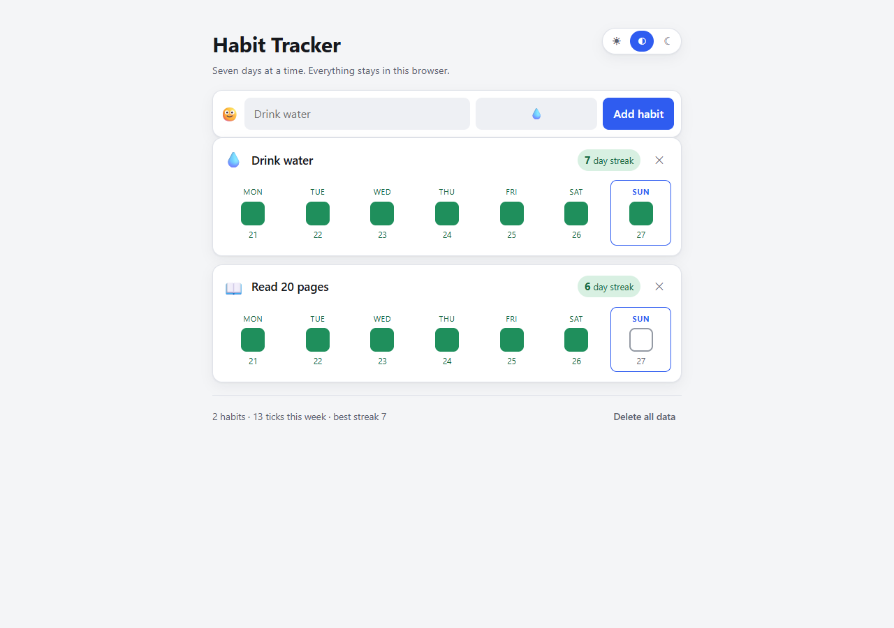

# Habit Tracker

A small habit tracker in plain HTML, CSS and JavaScript. No framework, no build
step, no dependencies, no server. Your habits live in your browser's
`localStorage` and nowhere else.



## What it does

- **Add habits** with a name and an emoji.
- **Tick off days** on a grid of the last seven days. One click toggles.
- **Streaks** — the badge counts consecutive days going back from today.
- **Delete** anything, behind a confirmation you have to actually click.
- **Persists** across reloads, tab closes and browser restarts.
- **Light and dark**, following your system setting by default.
- **Works on a phone** — the layout is fine down to 375 px.

## Running it

The page is static, but it uses ES modules, which browsers refuse to load over
`file://`. So serve the folder over HTTP, any way you like:

```bash
# Python
python -m http.server 8000

# or Node, no packages required
npx --yes serve .
```

Then open <http://localhost:8000>.

The live version is on GitHub Pages:
**<https://depthark.github.io/habit-tracker/>**

## Running the tests

The tests use Node's built-in test runner. There is nothing to install — no
`npm install`, no dev dependencies.

```bash
node --test
```

Or, if you prefer the npm script:

```bash
npm test
```

To watch a single test file:

```bash
node --test logic.test.js
```

Requirements: Node 18 or newer. Expected result:

```
# tests 26
# pass 26
# fail 0
```

## How it is put together

| File | Job |
| --- | --- |
| `logic.js` | All the thinking: streaks, toggling, local-date handling, serialising. **No DOM access at all.** |
| `logic.test.js` | The test suite for the above. |
| `app.js` | Wiring only: reads the DOM, asks `logic.js` what to show, paints it. |
| `index.html` | Markup and the two `<template>`s the renderer clones. |
| `styles.css` | Everything visual, including both colour themes. |

The split is the point. Because `logic.js` never touches the DOM, the awkward
parts — what counts as a streak, what happens at midnight, what to do with
corrupt saved data — are all reachable from a plain unit test.

### The one deliberate decision worth knowing about

**Today not being ticked does not break your streak.** If you did Monday to
Friday and it is Friday evening, you still have a 5-day streak; the chain only
breaks at midnight. This is what `currentStreak(habit, today)` does by default.

If you would rather have the strict version, it is one argument away:

```js
currentStreak(habit, today, { todayPending: false }); // 0 if today is unticked
```

Both behaviours are covered by tests.

### Dates

Days are stored as `'YYYY-MM-DD'` strings built from **local** date parts. The
usual shortcut, `toISOString().slice(0, 10)`, converts to UTC first and will
quietly log your tick on the wrong day for anyone not on UTC. `parseKey` also
rejects impossible dates like `2026-02-30`, which `Date` would otherwise roll
over into March.

## Privacy

There is no analytics, no account, no network call. The only thing written
anywhere is the `habit-tracker:v1` key in your own `localStorage`. Clearing
site data erases it permanently, so there is no cloud copy — which is the point,
but also the trade-off.

## Licence

MIT.
