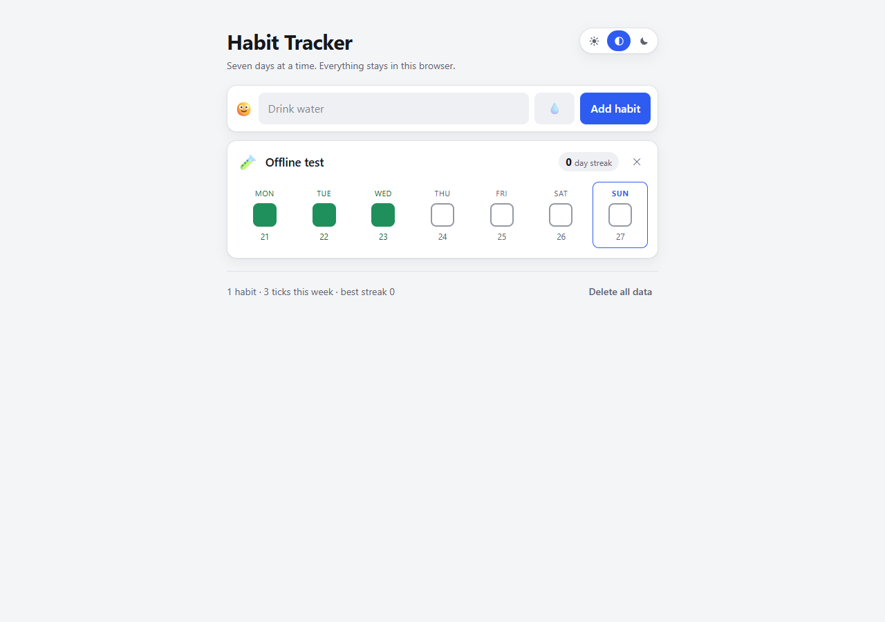

# Habit Tracker

A small habit tracker built with **Astro**, **Tailwind CSS** and **Bun**. No UI
framework, no backend, no database. Your habits live in your browser's
`localStorage` and nowhere else. It installs as a PWA and works offline.


## What it does

- **Add habits** with a name and an emoji.
- **Tick off days** on a grid of the last seven days. One click toggles.
- **Streaks** — the badge counts consecutive days going back from today.
- **Delete** anything, behind a confirmation you have to actually click.
- **Persists** across reloads, tab closes and browser restarts.
- **Light and dark**, following your system setting by default.
- **Installable** — add it to your home screen and it runs offline.
- **Works on a phone** — the layout is fine down to 375 px.

## Running it

```bash
bun install
bun run dev        # http://localhost:4321/habit-tracker
```

Note the `/habit-tracker` path: the site is configured for a sub-path on GitHub
Pages, so it is served under that prefix locally too.

Other commands:

```bash
bun run build      # static output into dist/
bun run preview    # serve the built output
bun run check      # type-check, including .astro templates
bun test           # the test suite
```

Requires [Bun](https://bun.sh) 1.2+. Node 18+ also works for `build`, `preview`
and `node --test`.

## TypeScript 7

The project type-checks with **TypeScript 7.1** via the
[`@astrojs/ts-content-mapper`](https://github.com/withastro/astro/tree/main/packages/language-tools/ts-content-mapper),
which lets `tsc` parse `.astro` files directly:

```bash
bun run check      # tsc --noEmit --runExternalCode
```

Two things are worth knowing if you touch this:

- **`astro check` is gone.** It rejects TypeScript 7 outright — the CLI is built
  on the TypeScript language service, which the 7.x compiler does not provide.
  `tsc` plus the content mapper replaces it, and covers the same ground.
- **The version is a pinned nightly.** `astro check` needs 7.1+, and 7.1 exists
  only as `7.1.0-dev.*` builds; stable 7.0.2 does not have the content-mapper
  hooks. The platform binaries are `optionalDependencies`, so only the one
  matching your machine is installed. If you would rather not track a nightly,
  `typescript@7.0.2` plus dropping the mapper is the stable-only fallback — the
  cost is that `.astro` templates go unchecked.

`--runExternalCode` is not optional: content mappers execute code from
`node_modules` during compilation, and TypeScript requires an explicit opt-in.

One more quirk: `tsconfig.json` deliberately does **not** include
`.astro/types.d.ts`. That file references `astro/client`, which pulls Astro's
own shipped `<Font>` and `<Picture>` components into the program; they reference
a virtual module that only exists inside the Astro build, so a standalone `tsc`
can never resolve it and reports errors in code that is not ours. The ambient
types we actually use are declared in `src/env.d.ts` instead.

## Running the tests

No test framework is installed — the suite runs on the built-in runner, under
either Bun or Node:

```bash
bun test           # Bun's runner
node --test        # Node's built-in runner
```

`src/lib/testkit.js` picks the right `test` import for whichever runtime is
running, so one test file serves both. The assertions are plain
`node:assert`, which both runtimes implement.

Expected result:

```
 26 pass
 0 fail
```

Coverage includes the awkward cases: an empty habit, a streak spanning a month
*and* a year boundary, today not yet ticked, future dates, and corrupt saved
data. There is also a test asserting `logic.js` contains no DOM references.

## How it is put together

```
src/
  env.d.ts          ambient types: import.meta.env, *.css
  lib/logic.js       pure functions: streaks, toggling, dates, serialising
  lib/logic.test.js  the test suite
  lib/testkit.js     picks bun:test or node:test
  lib/storage.js     the only module that touches localStorage
  pages/index.astro  the page: markup plus the two <template>s
  layouts/Base.astro document shell, theme bootstrap, PWA head tags
  scripts/app.js     client wiring: DOM in, logic.js out
  styles/global.css  design tokens and the handful of component classes
public/
  manifest.webmanifest, sw.js, icons
scripts/
  generate-icons.mjs draws the PNG icons with no image library
```

Three boundaries worth respecting:

1. **`logic.js` never touches the DOM.** No `document`, no `window`, no
   `localStorage` — a test enforces this. Every awkward decision (what counts as
   a streak, what happens at midnight, what to do with corrupt data) is
   therefore reachable from a plain unit test.
2. **`storage.js` is the only module that touches `localStorage`.** It probes
   whether storage works at all and falls back to an in-memory store, so
   private browsing degrades instead of breaking.
3. **`app.js` does no arithmetic.** It renders what `logic.js` decides.

### The one deliberate decision worth knowing about

**Today not being ticked does not break your streak.** If you did Monday to
Friday and it is Friday evening, you still have a 5-day streak; the chain only
breaks at midnight. That is what `currentStreak(habit, today)` does by default.

If you would rather have the strict version, it is one argument away:

```js
currentStreak(habit, today, { todayPending: false }); // 0 if today is unticked
```

Both behaviours are covered by tests.

### Theming

The palette is defined once as CSS custom properties in `@theme`. No component
carries a `dark:` variant — they ask for `bg-surface` or `text-ink-soft` and the
token underneath changes. That is why both themes live in one block, and why
adding the manual override cost three lines instead of thirty.

Every foreground/background pairing was checked against WCAG contrast ratios;
`axe` reports 0 violations in both themes.

### The service worker

`public/sw.js` is hand-written rather than generated. `@vite-pwa/astro` only
declares peer support up to Astro 5, and the app is on Astro 7, so rather than
pin the project to an older major for one plugin, the worker is 90 readable
lines with three strategies: network-first for navigations, cache-first for
everything else, and a precached shell.

Two details that are easy to get wrong and were caught by testing offline:

- `cache.match` must pass `{ ignoreVary: true }`. Without it the server's
  `Vary: Accept-Encoding` makes cached copies invisible and offline loads 504.
- On a first visit the CSS and JS are fetched *before* the worker exists, so
  `warmCache()` in `app.js` re-adds them. The browser answers from its own HTTP
  cache, so it is nearly free, and it avoids a `controllerchange` page reload.

To ship a change to the worker, bump `CACHE_VERSION` in `public/sw.js`; the old
cache is dropped on activation.



## Privacy

There is no analytics, no account and no network call. The only things written
anywhere are the `habit-tracker:v1` and `habit-tracker:theme` keys in your own
`localStorage`, plus the Cache Storage entries the service worker manages.
Clearing site data erases everything permanently — there is no cloud copy, which
is the point, but also the trade-off.

## Licence

MIT.
